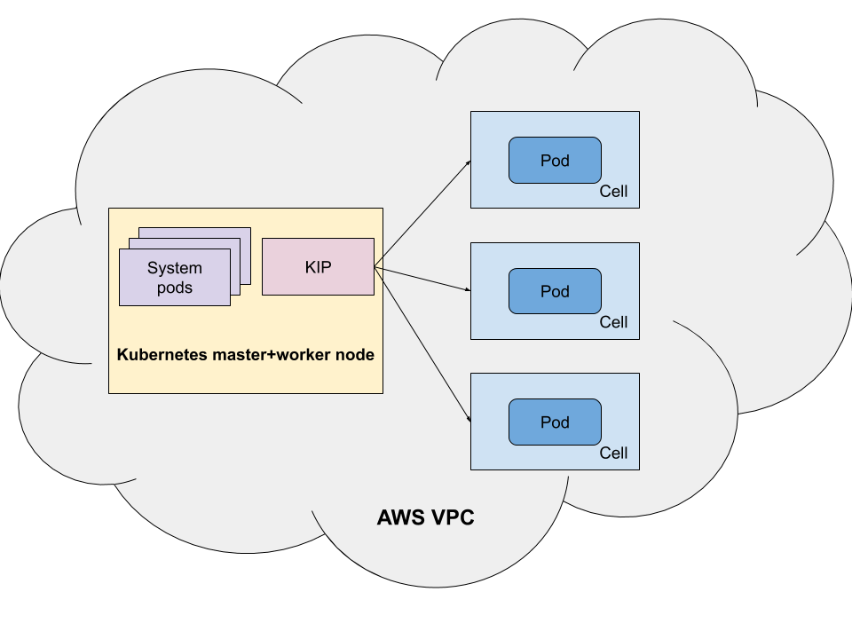

# Provision a Simple Test Cluster

The Terraform config here can be used to provision a simple test cluster with kip.

## Getting Started

You need:
* an AWS account configured (check that e.g. `aws iam get-user` works)
* Terraform >= 0.12
* aws-cli
* jq

You can then apply your config:

    cp env.tfvars.example myenv.tfvars
    vi myenv.tfvars # You can change settings for your cluster here.
    terraform apply -var-file myenv.tfvars

This will create a new VPC and a one-node Kubernetes cluster in it with kip, and show the public IP address of the node when done:

    [...]

    Apply complete! Resources: 13 added, 0 changed, 0 destroyed.

    Outputs:

    node-ip = 34.201.59.101

You can now ssh into the instance using the username "ubuntu", and the ssh key you set in your environment file. (It takes a a minute or two for the instance to bootstrap). On the instance, you can use kubectl to interact with your new cluster:

    $ kubectl get nodes
    NAME                          STATUS   ROLES    AGE   VERSION
    ip-10-0-26-113.ec2.internal   Ready    master   67s   v1.17.3
    kip               Ready    agent    13s   v1.14.0-vk-v0.0.1-125-g3b2cc98

If you haven't set an existing ssh key in your configuration, a new ssh key has been created. You can extract and use it via:

    $ terraform show -json | jq -r '.values.root_module.resources | .[] | select(.address=="tls_private_key.ssh-key") | .values.private_key_pem' > /tmp/id_rsa
    $ ssh -i /tmp/id_rsa ubuntu@<public IP of node>

## Run a Pod via Virtual Kubelet

The node taint in kip is disabled in the manifest, so Kubernetes will try to run all pods via the virtual node.

If you decide to enable the taint on the virtual node (via removing the `--disable-taint` command line flag), you will need to add a toleration and/or node selector for pods that are meant to run via kip:

    spec:
      nodeSelector:
        type: kip
      tolerations:
      - key: virtual-kubelet.io/provider
        operator: Exists
